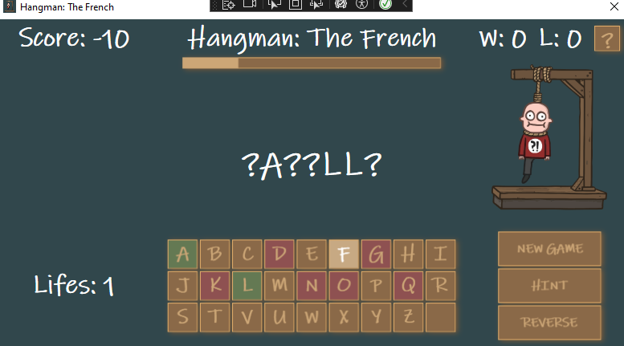

# Hangman Game



Welcome to **Hangman Game**, a fun and challenging word-guessing game built with C# and WPF! This project was created as part of my BTS CIEL1 coursework, where I learned a lot about WPF development. Dive into the game and see if you can master the art of guessing!

## Features
- **Hints**: Stuck on a word? Use hints to get some help, but be careful—they cost lives!
- **Reverse Mode**: Ramp up the difficulty by reversing the word, making each guess even more challenging.
- **Wins/Losses Tracker**: Keep track of your victories and defeats as you improve.
- **Timer**: Beat the clock and finish the word before time runs out.

## How to Play
1. Clone the repository from GitHub:
   ```bash
   git clone https://github.com/Dreycod/Hangman-WPF/tree/master
   ```
2. Open the solution in Visual Studio.
3. Run the application and start playing.
4. Guess letters to figure out the hidden word before you run out of lives.
5. Use hints wisely, and don’t forget to try the reverse mode for an added twist!

## Gameplay Highlights
- Enjoy a sleek WPF interface designed to make gameplay intuitive and engaging.
- Experience the thrill of racing against time with the built-in timer.
- Challenge yourself with reverse mode, perfect for those who seek an extra layer of difficulty.

## What I Learned
This was my very first game in C#, and it was an incredible learning experience! Through this project, I:
- Gained hands-on experience with WPF (Windows Presentation Foundation).
- Learned about event handling, UI design, and user interaction in C#.
- Developed problem-solving skills to tackle challenges in game development.

## Try It Out
Download the project from GitHub and give it a spin:
[Hangman-WPF on GitHub](https://github.com/Dreycod/Hangman-WPF/tree/master)

## Feedback
I’d love to hear your thoughts! If you have any feedback or suggestions, feel free to reach out. Your input will help me improve as a developer.

Thank you for checking out my Hangman Game, and happy guessing!
